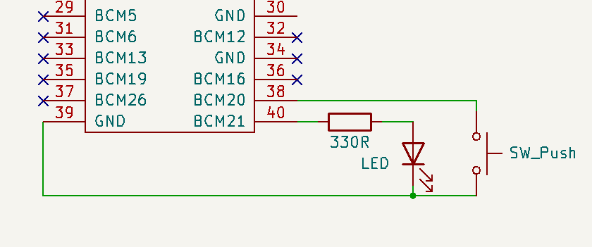

# Project 'Raspberry-Shutdown'

The  [Raspberry-Shutdown](https://github.com/ECOM-Engineering/Raspberry-Shutdown) project describes a very simple system in order to shut down Raspberry Pi safely. It consists of a Python 3.x script *button_LED.py*, a simple schematic and this description.
 This project is tested in Raspberry models 3, 3B, 4B, zero-wh under raspbian V10, Raspberry OS (Debian) and above.
 The python script uses the awesome [libgpiod](https://git.kernel.org/pub/scm/libs/libgpiod/libgpiod.git/about/) library,

## Background

Running Linux computer should not be powered off without a controlled shutdown by the operating system, because this can result in damaging the file system on the SD_Card. Raspberry computers do not provide a reset or power down switch.
 Controlled power down is especially critical important in so called headless systems with no monitor and keyboard.
 The presented solution allows initiating shutdown or a restart with a switch or an external signal.   
 The Project consists of a single Python 3.x script that may be started from command line or may be launched as auto-start process.

## Functionality

### Raspberry power up LED

After Linux boot, a selectable port (default BCM21) is driven high and LED goes ON

### Shutdown: switch pressed > 2 seconds

A switch on a selectable port (default BCM20) triggers events used in the script button_LED.py.
 Linux command `shutdown -P now` will be executed by the script button_LED.py. As soon as critical storage operations are completed, LED goes OFF.

### Restart: switch double clicked

System shuts down and restarts.
Linux command `shutdown -r now`  will be executed by the script button_LED.py

### Shutdown + power off: switch pressed > 5 seconds

(Power off needs external hardware)

#### Restart after shut down

This is only achievable by external power off and on again. (A much more convenient solution is using the ["UPS-2"](https://github.com/ECOM-Engineering/UPS-2_Uninteruptible-Power-Supply.git) project.

## Quick Install Summary

This summary is intended for experienced users.

1. Prepare hardware, see [Fig. 1](#Fig. 1)
2. Clone  shutdown project  
    `git clone https://github.com/ECOM-Klaus/Raspberry-Shutdown.git`
3. Install libgpiod library  
    `sudo apt install python3-libgpiod`
 5. Autostart button_LED.py script with systemd  
 See chapter `Autostart`
      
      	

## Software Installation

1. Download 'Raspberry Imager' and follow instructions for creating SD card:  
    https://www.raspberrypi.org/software/  
    This project works with all OS versions.
    	

2. Install required library on Raspberry:  
    `sudo apt install python3-libgpiod`

3. Download shutdown script or clone project
    Change to your project directory and download the Python3 project script  

   OR execute from your project directory   
    `git clone https://github.com/ECOM-Klaus/Raspberry-Shutdown.git`

5. Basic test  without hardware
    Change to your project directory and execute   
    `~ $ cd <your project directory>`

   Execute script help  
   `~ /<your project directory> $ python3 button_LED.py -h` 

 --> expected reponse:  
   `usage: button_LED.py [-h] [-l] [-s] [-p]`

​	 `optional arguments:`  
  `-h, --help          show this help message and exit`  
  `-l , --ledPort      LED output bcm port default = 21 0 = no LED`  
  `-s , --switchPort   Switch control input bcm port default = 20`  
  `-p , --powerPort    Optional bcm port for external power time`r  

## Hardware Installation

Required material: (example types)
- Metalfilm resistor 	330R, 1/4W
- Tactile Switch 		Tyco FSM8J
- Green LED 3mm 	    Kingbright L-7104SGC

   **Fig. 1**: Wiring Diagram with default ports.

## Test

Please test first with default ports. You may change it later by command line parameters. We test first by command line, later by autostart.

1. Raspi power on  
2. Wait until boot finished
3. Start a terminal (local or with an external ssh terminal)
4. Change to your project directory  
5. Execute `python3 button_LED.py`  
    --> LED should switch on
6. Press key for > 3 seconds (LED blinks once per second), then release switch  
    --> Raspberry should shut down and Led goes off  after SD card access is finished.  
 

## Autostart

**Before implementing autostart, perform the command line  tests in the previous chapter.** 

Normally you would start this script automatically during power-up. There are different methods to achieve this, but start should be independent of the start of a graphical desktop. So it is usable also on minimum systems suchlike Raspberry zero. Autostart using the **rc.local is deprecated** and in new Raspberry OS (Debian) with no effect! Instead we **use a systemd service** [link to more info](https://learn.sparkfun.com/tutorials/how-to-run-a-raspberry-pi-program-on-startup/method-3-systemd)

1. Edit the example file [shutdown.service](shutdown.service):   
   `sudo nano shutdown.service`  
   Adapt the path to your button_LED.py script:
   WorkingDirectory= **path to your script**

2. Save this file to :  
   `/lib/systemd/system/shutdown.service`
3. Tell systemd to recognize our service:  **(must always be executed after changes in script)**  
   `sudo systemctl daemon-reload`
4. Tell systemd to start the service on boot:  
`sudo systemctl enable shutdown.service`
5. Shuddown and reboot your raspberry. **LED should go ON after boot!**
6. Test switch functions: see chapter [Functionality](#3.Functionality|outline)
7. Some hints in case of autostart trouble:  
- `sudo systemctl stop shutdown.service`
- sudo systemctl disable shuddown service`` (service will not start on boot)
- have a lok on `sudo systemctl status shutdown.service`
- Test the script manually
- Re-enable the service `sudo systemctl enable shutdown.service`

## Using other I/O ports

Standard ports are BCM20 for LED and BCM21 for switch. External power off signal is disabled by default.

#### Other port for switch

Use parameter **-s**:   
`python3 button_LED.py -s<led port>`

#### Other port for LED

Use parameter **-l**:  
`python3 button_LED.py -l<switch port>**`

#### External power off   

This needs an external power supply that switches off after negative edge of suppy port.

Use parameter **-p**:  
`python3 button_LED.py -p<supply port>`

 
##   Trouble Shooting

- LED does not work when executing button_LED.py  
   --> if no error message, check hardware connections  
   --> if using other port than BCM21 call script with parameter	`python3 button_LED -l<port>`   
   --> if error message concerning 'gpiod', re-install		`sudo apt install python3-libgpiod`  
- Switch is not working	 
   --> check hardware connection  

Copyright (C) 2023 Klaus Mezger under [MIT license](https://opensource.org/licenses/MIT)

